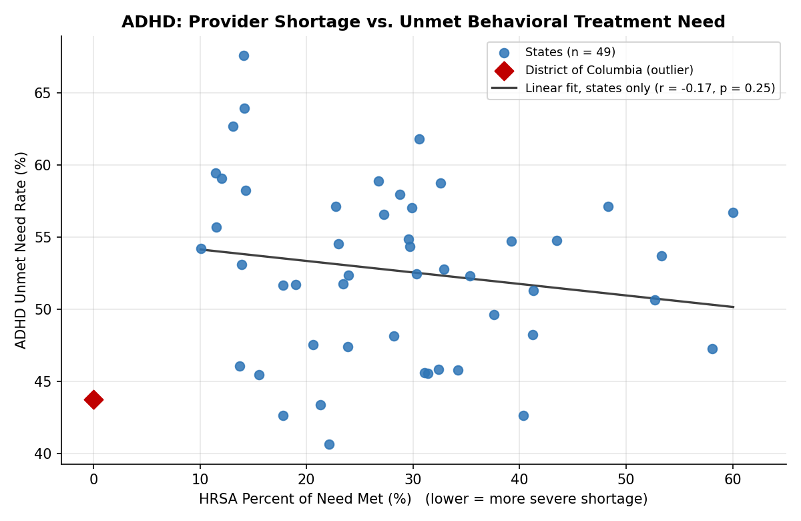
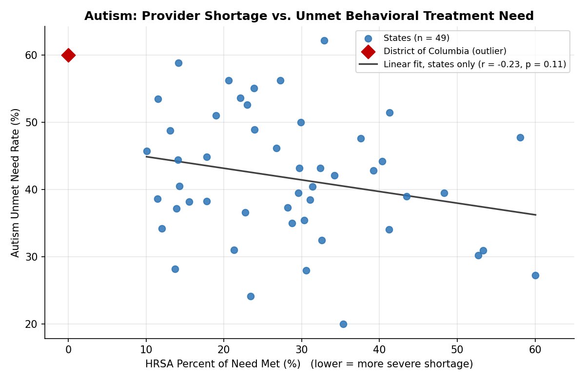

# Behavioral Health Access Gap Analysis: State-Level Provider Shortages vs. Unmet ADHD/Autism Treatment Need

## Overview

This project examines whether state-level mental health provider shortages are associated with unmet behavioral treatment need among children diagnosed with ADHD or autism spectrum disorder (ASD). It merges two public federal datasets across the 50 U.S. states plus DC and tests the relationship using Pearson and Spearman correlation analysis.

## Motivation

My background is in psychology and behavioral therapy, including direct clinical work in an autism care clinic, alongside pharmacy technician and retail operations management experience. This project was built to apply that clinical grounding to a real, data-driven population health question: do states with more severe mental health provider shortages also have more children going without needed behavioral treatment?

## Data Sources

- **Supply side:** [HRSA Health Professional Shortage Area (HPSA) Quarterly Summary](https://data.hrsa.gov/Default/GenerateHPSAQuarterlyReport), Table 5 (Mental Health Care HPSAs by State), 07/01/2024 quarter. Key measure: **Percent of Need Met** (lower = more severe shortage).
- **Demand side:** [National Survey of Children's Health (NSCH) 2023-2024](https://www.childhealthdata.org), Interactive Data Query. Indicators used:
  - 2.7 / 2.8: Current ADHD / Autism prevalence, ages 3-17
  - 2.7c / 2.8c: Received behavioral treatment for ADHD / Autism, ages 3-17

## Methodology

1. Pulled and cleaned both datasets to one row per state (51 units: 50 states + DC).
2. Calculated a derived **Unmet Need Rate** for each condition. Because NSCH reports treatment figures as a percentage of all children in the state, the rate among diagnosed children is:
   `Unmet Need Rate = Did Not Receive Treatment % / (Received Treatment % + Did Not Receive Treatment %) × 100`
3. Ran Pearson correlations (in jamovi) between HRSA Percent of Need Met and each condition's Unmet Need Rate, with Spearman rank correlations as a robustness check.
4. Conducted a sensitivity analysis after identifying DC as a statistical outlier (0% need met, far more extreme than any state). DC is also conceptually distinct as a single city rather than a state.

Vermont is excluded from all correlations because HRSA did not publish its Percent of Need Met for this quarter, leaving n = 50 including DC and n = 49 excluding DC.

## Key Findings

The expected direction is **negative**: states meeting more of their mental health need should show lower unmet treatment rates.

| Condition | Sample | n | Pearson r | p | Spearman ρ | p |
|---|---|---|---|---|---|---|
| ADHD | Including DC | 50 | -0.094 | 0.516 | -0.137 | 0.344 |
| ADHD | Excluding DC | 49 | -0.168 | 0.248 | -0.199 | 0.171 |
| Autism | Including DC | 50 | **-0.293** | **0.039** | -0.241 | 0.092 |
| Autism | Excluding DC | 49 | -0.231 | 0.110 | -0.197 | 0.175 |

**Honest takeaway:** an initial pass suggested a statistically significant relationship for autism. A sensitivity check revealed this result was driven substantially by DC as a single outlier. With DC excluded, or with the rank-based Spearman method, neither relationship reaches statistical significance, though both trend in the expected direction. This is reported here rather than the more "impressive" but outlier-driven initial result, since data integrity matters more than a clean headline.

With roughly 50 units, this analysis only has good power to detect fairly strong correlations (about |r| ≥ 0.4). The results are therefore best read as **inconclusive** rather than as evidence that no relationship exists.

## Limitations

- **Level of analysis:** all data are state-level aggregates, so these results describe states, not individual families.
- **Scope of the HRSA measure:** Percent of Need Met is calculated only within designated shortage areas, not across the whole state population, so it captures shortage severity where HPSAs exist rather than how widespread shortages are.
- **Provider type mismatch:** mental health HPSAs are scored mainly on psychiatrists and core mental health professionals serving the general population. Children with autism typically rely on behavioral therapists, BCBAs, developmental pediatricians, and speech or occupational therapists, whose supply this measure does not capture.
- **"Did not receive behavioral treatment" is not the same as unmet need:** this matters especially for ADHD, where many children are managed with medication alone and may not need behavioral treatment. This may help explain why the ADHD relationship is weaker than the autism one.
- **Survey precision:** some state-level NSCH estimates carry wide confidence intervals due to smaller state samples, and published percentages are rounded to 0.1 point. Where values are small (some autism figures are below 1%), rounding alone can shift the derived Unmet Need Rate by several points.
- **Missing data:** Vermont's HRSA shortage figures were blank in the source report for this quarter.
- **Bivariate only:** the analysis does not control for insurance type, income, or rurality, which likely also affect treatment access.
- **Single time point:** HRSA data reflect one quarterly report; results may shift slightly with newer quarters.

## Next Steps

- Add a second supply measure: population living in designated mental health HPSAs as a share of total state population, and practitioners needed per 100,000 people in designated areas.
- Compare against the NSCH ADHD medication indicator to separate behavioral treatment gaps from overall treatment gaps.
- Extend to a multiple regression controlling for insurance coverage, income, and rurality.

## Tools Used

Excel (data cleaning, merging, derived formulas, visualization), jamovi (statistical analysis)

## Files in This Repository

- `hrsa_mental_health_hpsa.xlsx`: cleaned HRSA supply-side data
- `merged_master_data_with_charts.xlsx`: full merged dataset, derived measures, scatter plots, and a Correlation Results sheet
- `adhd_scatter.png`, `autism_scatter.png`: scatter plots shown above
- `README.md`: this file

## Author

Dhruvi Modi
